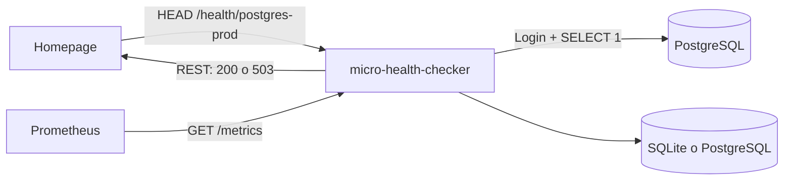

<div align="center">
  <!-- translation-source: README.md -->
  

  <p><strong>Convertí servicios sin HTTP en endpoints REST de salud simples.</strong></p>
  <p>Un contenedor pequeño. Configuración YAML. SQLite por defecto. Creado para Homepage, Prometheus, homelabs y equipos de plataforma.</p>

  [](https://github.com/cdguru/micro-health-checker/actions/workflows/ci.yml)
  [](https://github.com/cdguru/micro-health-checker/actions/workflows/codeql.yml)
  [](https://github.com/cdguru/micro-health-checker/releases)
  [](https://github.com/cdguru/micro-health-checker/pkgs/container/micro-health-checker)
  [](LICENSE)
  [](go.mod)

  <p><a href="README.md">English</a> · <strong>Español</strong></p>

  [Inicio rápido](#inicio-rapido) · [Integraciones](docs/es/INTEGRATIONS.md) · [Configuración](#configuracion) · [API](#api-http) · [Contribuir](CONTRIBUTING.es.md)
</div>

---

> Esta es la traducción española. La documentación inglesa es la fuente canónica ante cualquier diferencia.

`micro-health-checker` es un pequeño **gateway de salud protocol-to-REST**. Comprueba bases de datos, brokers y servicios de infraestructura usando el protocolo o la operación de salud que realmente entienden, y luego expone el resultado como un endpoint HTTP que pueden consumir dashboards, orquestadores y clientes simples.

Responde una pregunta engañosamente importante: **¿la aplicación realmente puede responder o solamente tiene un puerto abierto?**

Una conexión TCP a PostgreSQL demuestra que algo está escuchando en el puerto `5432`. Un check PostgreSQL autentica, abre una transacción de solo lectura y ejecuta `SELECT 1`. El resultado se traduce a un endpoint HTTP `200` o `503` que herramientas como [Homepage](https://gethomepage.dev/) pueden consumir directamente.

## Por qué existe

La mayoría del software de infraestructura no expone el pequeño recurso REST de salud que esperan herramientas como Homepage. Las sondas genéricas son excelentes para comprobar conectividad de red, pero no siempre pueden determinar la salud de la aplicación. Este proyecto cubre ambas necesidades sin exigir una plataforma de monitoreo completa para un despliegue pequeño.

- **Checks de protocolo reales** — PostgreSQL significa autenticación más una consulta, no solamente abrir un socket.
- **Comportamiento nativo para Homepage** — `GET` y `HEAD /health/{id}` devuelven `200` o `503` e incluyen la latencia real del check.
- **Modo de un solo contenedor** — SQLite embebido es la opción predeterminada; no se necesita otro servicio de base de datos.
- **Camino de crecimiento** — se puede cambiar el almacenamiento histórico a PostgreSQL sin modificar las definiciones de checks.
- **Recarga automática** — permite agregar, quitar o modificar checks sin reiniciar el servicio.
- **Métricas Prometheus** — disponibilidad, latencia, totales y fecha del último check.
- **Pequeña interfaz integrada** — responsiva, de solo lectura y con actualización automática.
- **Última configuración válida** — un YAML inválido se rechaza sin interrumpir los checks activos.
- **YAML compatible con secretos** — la expansión `${ENVIRONMENT_VARIABLE}` mantiene credenciales fuera de los archivos de configuración.
- **Binario estático único** — driver SQLite en Go puro e imagen de runtime distroless.

## Qué comprueba actualmente

| Tipo | Qué significa un resultado exitoso | Estado |
| --- | --- | --- |
| `tcp` | Se estableció una conexión TCP | Disponible |
| `http` | La solicitud HTTP, el estado esperado y la aserción opcional del body fueron correctos | Disponible |
| `postgres` | La autenticación, la transacción de solo lectura y la consulta de salud fueron correctas | Disponible |

Estos son los tres motores implementados actualmente, no treinta drivers nativos ocultos. El soporte de productos se documenta deliberadamente en tres niveles:

- **Semántico** — un check consciente del protocolo demuestra que la aplicación puede realizar una operación significativa.
- **Receta** — un motor genérico existente utiliza un endpoint de salud provisto por el producto.
- **Sólo conectividad** — TCP demuestra alcance de red mientras el driver semántico continúa planificado.

El [catálogo de integraciones](docs/es/INTEGRATIONS.md) enumera los 30 productos objetivo, su nivel exacto de soporte actual, un ejemplo YAML para cada uno y cuáles drivers semánticos continúan planificados.

<a id="inicio-rapido"></a>
## Inicio rápido

### Docker Compose

```bash
git clone https://github.com/cdguru/micro-health-checker.git
cd micro-health-checker
cp .env.example .env
docker compose up -d --build
```

Abrí:

- UI: `http://localhost:8080/`
- API: `http://localhost:8080/api/v1/status`
- Métricas: `http://localhost:8080/metrics`
- Readiness: `http://localhost:8080/-/ready`

El despliegue Compose predeterminado utiliza un contenedor de aplicación y un volumen con SQLite. Comienza con un self-check para que la interfaz sea útil inmediatamente. El servicio PostgreSQL incluido pertenece al perfil opcional `demo`; utilizá `configs/config.example.yml` cuando quieras probar el driver semántico de PostgreSQL:

```bash
docker compose --profile demo up -d --build
```

### Contenedor publicado

```bash
docker run --rm \
  --name micro-health-checker \
  -p 8080:8080 \
  -e POSTGRES_PROD_DSN='postgres://healthcheck:secret@db:5432/app?sslmode=require' \
  -v "$PWD/config.yml:/etc/micro-health-checker/config.yml:ro" \
  -v micro-health-checker-data:/data \
  ghcr.io/cdguru/micro-health-checker:latest
```

### Compilar desde el código fuente

```bash
make test
make build
./bin/micro-health-checker -config ./config.yml
```

Se requiere Go 1.26 o posterior.

<a id="configuracion"></a>
## Configuración

El ejemplo completo está disponible en [`configs/config.example.yml`](configs/config.example.yml).

```yaml
server:
  address: ":8080"

scheduler:
  default_interval: 30s
  default_timeout: 5s

storage:
  type: sqlite
  retention: 30d
  sqlite:
    path: /data/micro-health-checker.db

checks:
  - id: postgres-prod
    name: PostgreSQL Production
    type: postgres
    interval: 15s
    timeout: 3s
    postgres:
      dsn: ${POSTGRES_PROD_DSN}
      query: SELECT 1
```

Los cambios en `checks` y en los valores predeterminados del scheduler se detectan y aplican automáticamente. Los cambios de dirección del servidor o almacenamiento requieren reiniciar. Las modificaciones inválidas se registran y la última configuración válida permanece activa.

Consultá la [referencia de configuración](docs/es/CONFIGURATION.md) para conocer los campos de los motores y el [catálogo de integraciones](docs/es/INTEGRATIONS.md) para ver recetas específicas por producto.

## Integración con Homepage

Homepage envía primero `HEAD` y, si es necesario, utiliza `GET`. Ambos métodos ejecutan el check real y devuelven el código de estado correspondiente.

```yaml
- Homelab:
    - PostgreSQL:
        icon: postgresql.png
        href: https://your-postgres-admin.example
        siteMonitor: http://micro-health-checker:8080/health/postgres-prod
```

Cuando PostgreSQL responde, Homepage muestra la latencia medida, por ejemplo `7 ms`. Si falla la autenticación o `SELECT 1`, muestra `ERROR` sin agregar un widget grande ni campos personalizados.

## Cómo funciona



Los checks programados actualizan continuamente la interfaz, las métricas y el historial. Las solicitudes a `/health/{id}` ejecutan un check bajo demanda para que el tiempo de respuesta HTTP refleje al servicio objetivo y no un valor cacheado.

## Modos de almacenamiento

| Modo | Servicio adicional | Recomendado para | Notas |
| --- | ---: | --- | --- |
| SQLite | No | Un solo contenedor, homelabs e instalaciones pequeñas o medianas | Predeterminado, modo WAL y migraciones automáticas |
| PostgreSQL | Sí | Instalaciones centralizadas y mayor retención | Mismo comportamiento de esquema y API |

La configuración permanece en YAML. El almacenamiento contiene resultados de checks e historial de incidentes, nunca credenciales de los servicios objetivo.

<a id="api-http"></a>
## API HTTP

| Método | Endpoint | Propósito |
| --- | --- | --- |
| `GET` | `/` | Interfaz de estado integrada |
| `GET` | `/api/v1/status` | Todos los estados cacheados y el resumen |
| `GET` | `/api/v1/status/{id}` | Estado cacheado de un check |
| `GET` | `/api/v1/history/{id}?limit=50` | Historial persistido de resultados |
| `GET`, `HEAD` | `/health/{id}` | Ejecuta el check; devuelve `200` o `503` |
| `GET` | `/metrics` | Exposición para Prometheus |
| `GET` | `/-/healthy` | Liveness del proceso |
| `GET` | `/-/ready` | Readiness del almacenamiento |
| `POST` | `/-/reload` | Recarga manual, sólo cuando está habilitada explícitamente |

El contrato legible por herramientas está disponible en [`api/openapi.yaml`](api/openapi.yaml).

## Métricas Prometheus

```text
micro_health_checker_check_up{check_id="postgres-prod",check_type="postgres"} 1
micro_health_checker_check_duration_seconds{check_id="postgres-prod",check_type="postgres"} 0.006
micro_health_checker_checks_total{check_id="postgres-prod",check_type="postgres",result="ok"} 42
micro_health_checker_check_last_run_timestamp_seconds{check_id="postgres-prod",check_type="postgres"} 1.789...
```

El servicio también exporta las métricas estándar del runtime de Go y del proceso.

## Modelo de seguridad

- El contenedor se ejecuta como usuario sin privilegios y con todas las capabilities de Linux eliminadas en el ejemplo Compose.
- La imagen de producción es distroless y no contiene shell ni administrador de paquetes.
- Las consultas de salud PostgreSQL se ejecutan dentro de transacciones de solo lectura.
- Las credenciales deben inyectarse mediante variables de entorno y una cuenta dedicada con privilegios mínimos.
- El endpoint de recarga está deshabilitado por defecto.
- La UI y la API no incluyen autenticación intencionalmente; exponelas solamente en redes confiables o detrás de un reverse proxy autenticado.
- `insecure_skip_verify` está disponible para diagnosticar PKI privada, pero no debería utilizarse como valor predeterminado.

Informá vulnerabilidades según [`SECURITY.es.md`](SECURITY.es.md), no mediante un issue público.

## Estado del proyecto

Este repositorio se encuentra en su etapa inicial de desarrollo público. La API principal y el formato YAML seguirán versionado semántico, pero antes de `v1.0.0` pueden producirse cambios incompatibles que se documentarán en el changelog.

## Contribuir

Las contribuciones de drivers de protocolo, presets, documentación y pruebas son bienvenidas. Comenzá por [`CONTRIBUTING.es.md`](CONTRIBUTING.es.md) y abrí una propuesta antes de implementar un driver importante.

Si este proyecto te evita desplegar una plataforma de monitoreo más grande para dos servicios, considerá darle una ⭐. Eso ayuda a que otros ingenieros de homelab y plataforma puedan descubrirlo.

## Licencia

Licenciado bajo [Apache License 2.0](LICENSE). Copyright © 2026 Christian Dente y colaboradores.

<div align="center"><sub>Creado para homelabs pequeños, diseñado con prácticas de producción.</sub></div>
