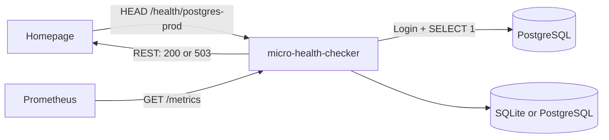

<div align="center">
  <!-- canonical-language: en -->
  

  <p><strong>Turn non-HTTP services into simple REST health endpoints.</strong></p>
  <p>One small container. YAML configuration. SQLite by default. Built for Homepage, Prometheus, homelabs and platform teams.</p>

  [](https://github.com/christiandente/micro-health-checker/actions/workflows/ci.yml)
  [](https://github.com/christiandente/micro-health-checker/actions/workflows/codeql.yml)
  [](https://github.com/christiandente/micro-health-checker/releases)
  [](https://github.com/christiandente/micro-health-checker/pkgs/container/micro-health-checker)
  [](LICENSE)
  [](go.mod)
  [](README.es.md)

  <p><strong>English</strong> · <a href="README.es.md">Español</a></p>

  [Quick start](#quick-start) · [Integrations](docs/INTEGRATIONS.md) · [Configuration](#configuration) · [API](#http-api) · [Contributing](CONTRIBUTING.md)
</div>

---

`micro-health-checker` is a small **protocol-to-REST health gateway**. It checks databases, brokers and infrastructure services using the protocol or health operation they actually understand, then exposes the result as an HTTP endpoint that dashboards, orchestrators and simple clients can consume.

It answers a deceptively important question: **is the application actually able to respond, or is its port merely open?**

A TCP connection to PostgreSQL proves that something is listening on port `5432`. A PostgreSQL check authenticates, opens a read-only transaction and runs `SELECT 1`. The result is translated into an HTTP `200` or `503` endpoint that tools such as [Homepage](https://gethomepage.dev/) can consume directly.

## Why this exists

Most infrastructure software does not expose the tiny REST health resource that tools such as Homepage expect. Generic probes are excellent for network reachability, but they cannot always establish application health. This project bridges both gaps without requiring a full monitoring platform for a small deployment.

- **Real protocol checks** — PostgreSQL means authentication plus a query, not a socket check.
- **Homepage-native behavior** — `GET` and `HEAD /health/{id}` return `200` or `503` and include actual check latency.
- **One-container mode** — embedded SQLite is the default; no database service is required.
- **Scale-up path** — switch history storage to PostgreSQL without changing check definitions.
- **Hot reload** — add, remove or modify checks without restarting the service.
- **Prometheus metrics** — availability, latency, totals and last-run timestamps.
- **Tiny built-in UI** — responsive, read-only and automatically refreshed.
- **Last-known-good configuration** — invalid YAML is rejected without interrupting active checks.
- **Secret-friendly YAML** — `${ENVIRONMENT_VARIABLE}` expansion keeps credentials out of configuration files.
- **Single static binary** — pure-Go SQLite driver and a distroless runtime image.

## What it checks today

| Type | What success means | Status |
| --- | --- | --- |
| `tcp` | A TCP connection was established | Available |
| `http` | HTTP request, status assertion and optional body assertion passed | Available |
| `postgres` | Authentication, read-only transaction and health query succeeded | Available |

These are the three engines implemented today—not thirty hidden native drivers. Product support is deliberately documented at three levels:

- **Semantic** — a protocol-aware check proves the application can perform a meaningful operation.
- **Recipe** — an existing generic engine can use a product-provided health endpoint.
- **Connectivity only** — TCP can prove reachability while a semantic driver remains planned.

The [integration catalog](docs/INTEGRATIONS.md) lists all 30 target products, their exact current support level, a YAML example for each and which semantic drivers remain planned.

## Quick start

### Docker Compose

```bash
git clone https://github.com/christiandente/micro-health-checker.git
cd micro-health-checker
cp .env.example .env
docker compose up -d --build
```

Open:

- UI: `http://localhost:8080/`
- API: `http://localhost:8080/api/v1/status`
- Metrics: `http://localhost:8080/metrics`
- Readiness: `http://localhost:8080/-/ready`

The default Compose deployment uses one application container and one named volume containing SQLite. It starts with a self-check so the UI becomes useful immediately. The included PostgreSQL service belongs to the optional `demo` profile; use `configs/config.example.yml` when you are ready to test the semantic PostgreSQL driver:

```bash
docker compose --profile demo up -d --build
```

### Published container

```bash
docker run --rm \
  --name micro-health-checker \
  -p 8080:8080 \
  -e POSTGRES_PROD_DSN='postgres://healthcheck:secret@db:5432/app?sslmode=require' \
  -v "$PWD/config.yml:/etc/micro-health-checker/config.yml:ro" \
  -v micro-health-checker-data:/data \
  ghcr.io/christiandente/micro-health-checker:latest
```

### Build from source

```bash
make test
make build
./bin/micro-health-checker -config ./config.yml
```

Go 1.26 or newer is required.

## Configuration

The complete example is available at [`configs/config.example.yml`](configs/config.example.yml).

```yaml
server:
  address: ":8080"

scheduler:
  default_interval: 30s
  default_timeout: 5s

storage:
  type: sqlite
  retention: 30d
  sqlite:
    path: /data/micro-health-checker.db

checks:
  - id: postgres-prod
    name: PostgreSQL Production
    type: postgres
    interval: 15s
    timeout: 3s
    postgres:
      dsn: ${POSTGRES_PROD_DSN}
      query: SELECT 1
```

Changes to `checks` and scheduler defaults are detected and applied automatically. Server address and storage changes require a restart. Invalid changes are logged and the last valid configuration remains active.

See the [configuration reference](docs/CONFIGURATION.md) for engine fields and the [integration catalog](docs/INTEGRATIONS.md) for product-specific recipes.

## Homepage integration

Homepage sends `HEAD` first and falls back to `GET`. Both methods execute the real check and return the correct status code.

```yaml
- Homelab:
    - PostgreSQL:
        icon: postgresql.png
        href: https://your-postgres-admin.example
        siteMonitor: http://micro-health-checker:8080/health/postgres-prod
```

When PostgreSQL answers, Homepage displays the measured latency, for example `7 ms`. When authentication or `SELECT 1` fails, it displays `ERROR` without adding a large widget or custom fields.

## How it works



Scheduled checks continuously update the UI, metrics and history. Requests to `/health/{id}` execute an on-demand check so the HTTP response time reflects the target service rather than a cached value.

## Storage modes

| Mode | Additional service | Best for | Notes |
| --- | ---: | --- | --- |
| SQLite | No | Single container, homelabs, small and medium installations | Default, WAL mode, automatic migrations |
| PostgreSQL | Yes | Centralized installations and longer retention | Same schema behavior and API |

Configuration remains in YAML. Storage contains check results and incident history, never target credentials.

## HTTP API

| Method | Endpoint | Purpose |
| --- | --- | --- |
| `GET` | `/` | Embedded status UI |
| `GET` | `/api/v1/status` | All cached states and summary |
| `GET` | `/api/v1/status/{id}` | Cached state for one check |
| `GET` | `/api/v1/history/{id}?limit=50` | Persisted result history |
| `GET`, `HEAD` | `/health/{id}` | Execute the check; return `200` or `503` |
| `GET` | `/metrics` | Prometheus exposition |
| `GET` | `/-/healthy` | Process liveness |
| `GET` | `/-/ready` | Storage readiness |
| `POST` | `/-/reload` | Manual reload, only when explicitly enabled |

The machine-readable contract is available in [`api/openapi.yaml`](api/openapi.yaml).

## Prometheus metrics

```text
micro_health_checker_check_up{check_id="postgres-prod",check_type="postgres"} 1
micro_health_checker_check_duration_seconds{check_id="postgres-prod",check_type="postgres"} 0.006
micro_health_checker_checks_total{check_id="postgres-prod",check_type="postgres",result="ok"} 42
micro_health_checker_check_last_run_timestamp_seconds{check_id="postgres-prod",check_type="postgres"} 1.789...
```

The service also exports standard Go runtime and process metrics.

## Security model

- The container runs as an unprivileged user with all Linux capabilities dropped in the Compose example.
- The production image is distroless and contains no shell or package manager.
- PostgreSQL health queries execute inside read-only transactions.
- Credentials should be injected through environment variables and a dedicated least-privilege account.
- The reload endpoint is disabled by default.
- The UI and API intentionally have no built-in authentication; expose them only on trusted networks or behind an authenticated reverse proxy.
- `insecure_skip_verify` is available for private PKI troubleshooting but should not be used as a default.

Please report vulnerabilities according to [`SECURITY.md`](SECURITY.md), not through a public issue.

## Project status

This repository is in its initial public-development stage. The core API and YAML format will follow semantic versioning, but breaking changes may occur before `v1.0.0` and will be documented in the changelog.

## Contributing

Protocol drivers, presets, documentation and tests are welcome. Start with [`CONTRIBUTING.md`](CONTRIBUTING.md) and open a proposal before implementing a large driver.

If this project saves you from deploying a larger monitoring stack for two services, consider giving it a ⭐. It helps other homelab and platform engineers discover it.

## License

Licensed under the [Apache License 2.0](LICENSE). Copyright © 2026 Christian Dente and contributors.

<div align="center"><sub>Built for small homelabs, designed with production habits.</sub></div>
